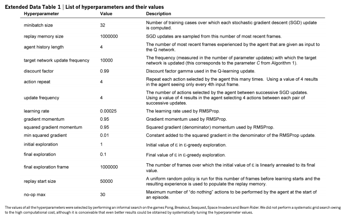

# DQN / Atari

[Human-level control through deep reinforcement
learning](https://storage.googleapis.com/deepmind-media/dqn/DQNNaturePaper.pdf)

Mnih, et al. Nature 2015

# Methods: Algorithm 1: deep-Q-learning with experience replay.

```
Initialize replay memory D to capacity N.
Initialize action-value function $Q$ with random weights $\Theta$.
Initialize target action-value function $\hat(Q)$ with weights $\Theta^- \leftarrow \Theta$.

**For** episode = 1,M, **do**
  Initialize sequence $s_1 = {x_1}$ and preprocessed sequence $\phi_1= \phi(s_1)$.
  
  **For** t=1,T **do**
    With probability `epsilon` select a random action $a_t$
      otherwise select $a_t = \text{arg} \max_a Q(\phi(s_t), a; \Theta)$.
    Execute action $a_t$ in emulator and observe reward $r_t$ and image $x_{t+1}$.
    Set $s_{t+1} = s_t, a_t, x_{t+1}$ and preprocess $\phi_{t+1} = \phi(s_{t+1})$.
    Store transition $(\phi_t, a_t, r_t, \phi_{t+1})$ in D.
    Sample random minibatch of transitions $(\phi_j, a_t, r_t, \phi_{j+1})$ from D.
    Set 
    $$
    y_j = \left\{
           \\begin{array}{ll}
           r_j, \text{if episode terminates at step j+1}\\
           r_j + \gamma \max_{a'} \hat(Q)(\phi_{j+1}, a'; \Theta^-), \text{otherwise}
           \\end{array}
    }
    $$
    Perform a gradient descent step on $(y_j - Q(\phi_j,a_j;\Theta))^2$
      w.r.t. network parameters $\Theta$.
    Every C steps reset $\hat(Q) = Q$
  **End For**
**End For**
```

## Extended Data Table 1: Hyperparameters


