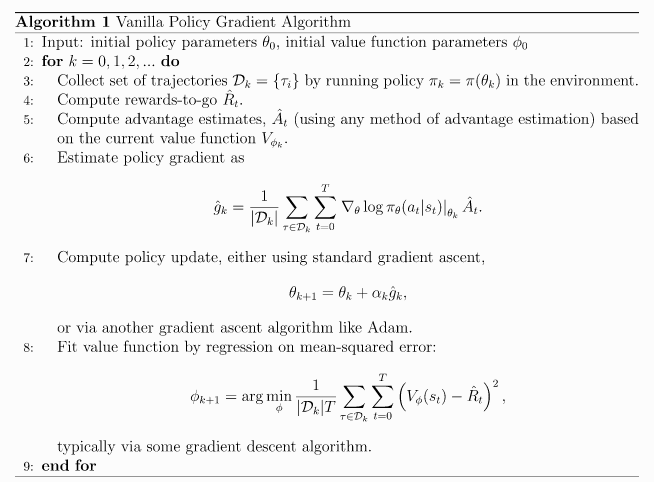

# Vanilla Policy Gradient (VPG)

## Overview

VPG uses policy gradient for finding a good policy.  The general policy gradient approach is to take an average over sampled trajectories, where the averaged quantity is the grad-log-prob multiplied by a weight, where the weight is related to the rewards associated with that trajectory.

Examples of some weights are:
- total rewards accumulated along a particular trajectory
- rewards-to-go (the weight of the grad-log-prob at a particular time step only includes rewards that were experienced after that time step)
- the action-value function
- the Advantage, defined as the difference of the action-value and value function, where the value function is acting as a baseline (any number can be used as a baseline, i.e. subtracted from the reward weight, as long as it is not dependent on the action, without changing mean gradient) that is used to reduce the variance of the gradient.

VPG is on policy, i.e. all sampled trajectories used to update the gradient were generated under the current policy.

### Neural nets are used in two places

1. to implement the policy.  Input: state.  Output: probability distribution over actions.
2. to approximate the value function that is used for GAE.  Note, the value function is used twice in the weight: (a) as a baseline, (b) for the (n-step/lambda) TD estimate of the action-value function.

## Implementation notes

- Spinning Up implements VPG using Generalied Advantage Estimation - lambda, GAE(lambda), as the weight.  This implementation uses TD(0), i.e. one-step TD learning as the weight for simplicity.

- The value function used to calculate the Advantage for one policy gradient iteration is actually the the value function fit on data generated by policies leading up to the previous one, i.e. we consciously choose not to re-fit the value function on the new data generated by the current policy before calculating the advantage function for stability reasons.

## Algorithm

## References
- Spinning Up in RL:
  * [Intro to policy optimization](https://spinningup.openai.com/en/latest/spinningup/rl_intro3.html)
  * [Vanilla Policy Gradient](https://spinningup.openai.com/en/latest/algorithms/vpg.html)
